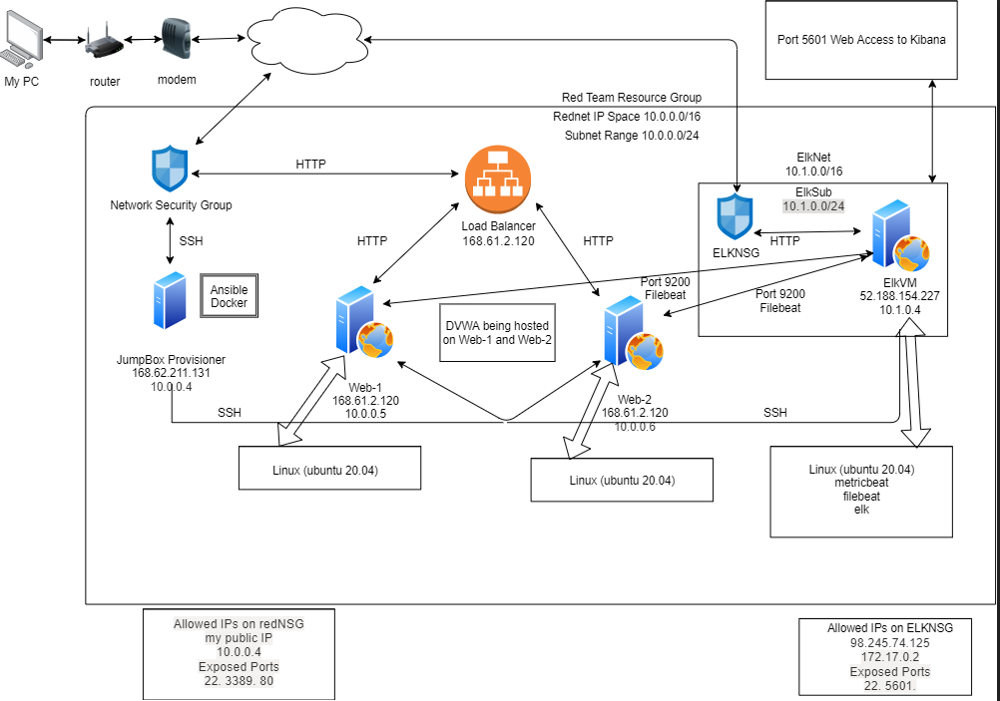
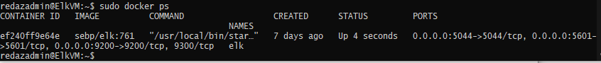

The files in this repository were used to configure the network depicted below.

These files have been tested and used to generate a live ELK deployment on Azure. They can be used to either recreate the entire deployment pictured above. Alternatively, select portions of the YAML configuration files may be used to install only certain pieces of it, such as Filebeat.

[ ELK YAML Playbook](Ansible/install_elk.yml)
 
This document contains the following details:
- Description of the Topology
- Access Policies
- ELK Configuration
  - Beats in Use
  - Machines Being Monitored
- How to Use the Ansible Build

### Description of the Topology

The main purpose of this network is to expose a load-balanced and monitored instance of DVWA, the D*mn Vulnerable Web Application.

Load balancing ensures that the application will be highly available, in addition to restricting accessibility to the network.
- It does this by shifting attack traffic from the corporate server to a public cloud provider. A jump server is a hardened and monitored device that spans two dissimilar security zones and provides a controlled means of access between them.

- Integrating an ELK server allows users to easily monitor the vulnerable VMs for changes to the jumpbox and system configuration
- Filebeat monitors the log files or locations that you specify, collects log events, and forwards them either to Elasticsearch or Logstash for indexing
- Metricbeat takes the metrics and statistics that it collects and ships them to the output that you specify, such as Elasticsearch or Logstash

- The configuration details of each machine may be found below.

| Name    | Function        | Internal IP Address | Operating System |
|---------|-----------------|---------------------|------------------|
| JumpBox | Gateway         | 10.0.0.4            | Ubuntu 20.04     |
| WEB1 VM | Host DWWA       | 10.0.0.5            | Ubuntu 20.04     |
| WEB2 VM | Redundent DWVA  | 10.0.0.6            | Ubuntu 20.04     |
| Elk VM  | Troubleshooting | 10.1.0.4            | Ubuntu 20.04     |

### Access Policies

The machines on the internal network are not exposed to the public Internet. 

  Only the jumpbox machine can accept connections from the Internet. 

- Access to this machine is only allowed from the following IP addresses:
- Whitelisted IPs: 10.0.0.4, my public IP address
- Machines within the network can only be accessed by SSH
- Allowed access to Elk VM internally: JumpBox, 172.17.0.2

- A summary of the access policies in place can be found in the table below.

| Name    | Publicly Accessible? | Allowed IP Addresses                  |
|---------|----------------------|---------------------------------------|
| JumpBox | No                   | my public IP                          |
| WEB1 VM | Yes                  | 10.0.0.4, internet                    |
| WEB2 VM | Yes                  | 10.0.0.4, internet                    |
| Elk VM  | Yes                  | 10.0.0.4, 10.0.0.5 10.0.0.6, internet |

### Elk Configuration

Ansible was used to automate configuration of the ELK machine. No configuration was performed manually, which is advantageous because...
- Free: Ansible is an open-source tool.
- Very simple to set up and use: No special coding skills are necessary to use Ansible’s playbooks (more on playbooks later).
- Powerful: Ansible lets you model even highly complex IT workflows.
- Flexible: You can orchestrate the entire application environment no matter where it’s deployed. You can also customize it based on your needs.
- Agentless: You don’t need to install any other software or firewall ports on the client systems you want to automate. You also don’t have to set up a separate management structure.
- Efficient: Because you don’t need to install any extra software, there’s more room for application resources on your server

The playbook implements the following tasks:
- it installs docker
- it ensures python3-pip is up to date
- it makes sure the docker module is defaulted to python3-pip
- it makes sure Elk has enough memory to run efficiently
- it makes sure filebeat and metricbeat have access

The following screenshot displays the result of running `docker ps` after successfully configuring the ELK instance.

**Note**: The following image link needs to be updated. Replace `docker_ps_output.png` with the name of your screenshot image file.  

### Target Machines & Beats
This ELK server is configured to monitor the following machines:

| Name    | Internal IP Address |
|---------|---------------------|
| WEB1 VM | 10.0.0.5            |
| WEB2 VM | 10.0.0.6            |

We have installed the following Beats on these machines:
- filebeat and metricbeat

These Beats allow us to collect the following information from each machine:
- Filebeat monitors the log files or locations that you specify, collects log events, and forwards them either to Elasticsearch or Logstash for indexing
- Metricbeat takes the (metadata) metrics and statistics that it collects and ships them to the output that you specify, such as Elasticsearch or Logstas

### Using the Playbook
In order to use the playbook, you will need to have an Ansible control node already configured. Assuming you have such a control node provisioned: 

SSH into the control node and follow the steps below:
- Copy the elk_install.yml file to /etc/ansible/roles/elk_install.yml
- Update the hosts file to include the attributes for your elk configuration and include your destination ip of the ELK server
- Run the playbook, and navigate to http://20.85.234.201:5601/app/kibana to check that the installation worked as expected.

_As a **Bonus**, provide the specific commands the user will need to run to download the playbook, update the 
